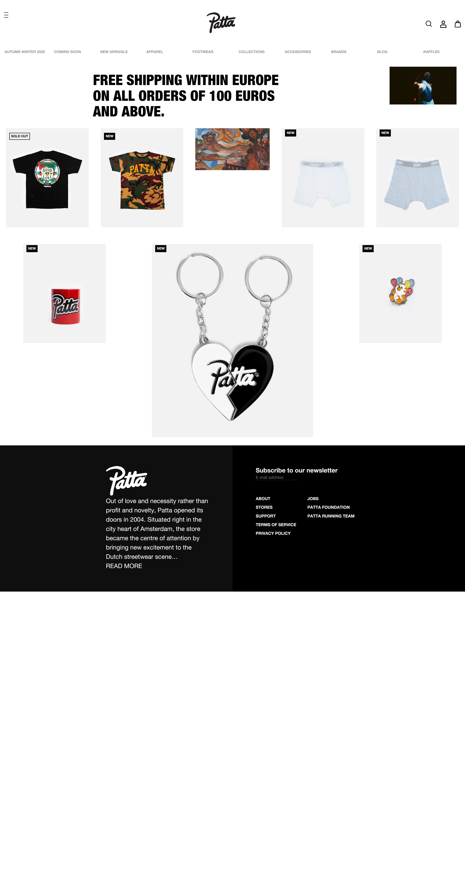

# Procesverslag
**Auteur:** Dylan Kho

Markdown cheat cheet: [Hulp bij het schrijven van Markdown](https://github.com/adam-p/markdown-here/wiki/Markdown-Cheatsheet). Nb. de standaardstructuur en de spartaanse opmaak zijn helemaal prima. Het gaat om de inhoud van je procesverslag. Besteedt de tijd voor pracht en praal aan je website.

## Bronnenlijst
Check links file

## Eindgesprek (week 7/8)

-dit ging goed & dit was lastig-

Dit ging goed de micro-interactie was makkelijker dan ik had gedacht. Verder vond ik dit vak echt moeilijk ik ben er gefrustreerd van geraakt waarom sommige dingen niet werkte, terwijl ik bijvoorbeeld hetzelfde deed als iemand op internet, het kan liggen aan de kleinste dingen! Al met al heb ik veel geleerd, flexbox begrijp ik beter nog niet volledig maar met internet kom ik er wel. Verder heb ik de product pagina ook naar flexbox verandert aangezien ik grid lastig vond heb ik de hele product pagina opnieuw gemaakt en is het toch responsive geworden. Als ik dit vak haal ben ik wel blij en kan ik toch met voldaan gevoel verder gaan in de opleiding! 

**Screenshot(s):**

-screenshot(s) van je eindresultaat-

## Voortgang 3 (week 6)

### Stand van zaken

### Agenda voor meeting

Het groepje, Babs, Kim Dylan en ik.

| student 1: | student 2: | student 3 | student 4 | Babs | Kim | Dylan | Esther | Minder CSS regels | Detailpagina end of type gebruiken | positionering | Sections indexpagina klikbaar maken | Positionering | crrousel maken of faken | | Tekst niet meeschalen pulsbolletjes | | | | Pulsbolletjes zichbaar in uitklap menu

## Verslag van meeting

Ik moet nog aan de bak in de vakantie, productpagina is kapot gegaan door het verwijderen van classes moet opnieuw ingericht worden. Gebruik maken van grid of flex verder. Ik wil eentje op de productpagina gebruiken en de andere op met flex pagina zodat ik ze heb gebruikt! Maar al met al er moet nog veel gebeuren in de vakantie... 

## Voortgang 2 (week 5)

### Stand van zaken
Het gaat wel de goede kant op, responsive is nog steeds lastig. Ik ben begonnen met de detailpagina en ziet er op mobile wel goed uit. De pagina's heb ik op de mobile gefixed verder zit ik alleen te denken hoe ik dit ooit op een grotere scherm mooi eruit ga laten zien... Ik denk dat dit de moeilijkste taak... En ook nog een micro-interactie veel stress voor deze week nog veel te doen dus!

### Agenda voor meeting
Het groepje, Babs, Kim, Dylan en ik.

| student 1: | student 2: | student 3 | student 4 | Babs | Kim | Dylan | Esther | How to carrousel maken | IMG swipen en of klikken | Icoon rechts zetten | Hoe krijg hover langzaam | Hoe minder regels CSS? | Show menutje | responsive | Tekst niet meeschalen puls rondje | | | | slide tekst in footer

## Verslag van meeting
Ik ben begonnen aan productpagina en ik heb veel moeite met de grid alle items staan maar random door elkaar!! Studentassistent zei dat ik dan misschien toch even naar flexbox moet kijken misschien dat het makkelijker is met positioneren. Ik wilde veranderen van resposive naar surface plane, toch niet gedaan dus ik ga nu echt voor responsive en zet mijn volledige focus hier!

## Voortgang 1 (week 3)

### Stand van zaken

Stand van zaken tjaa.. Ik heb op dit moment alleen de hoofdpagina, verder is het niet responsive en ik moet echt beginnen aan de detail pagina. Maar het positioneren is lastig vind ik. Wanneer je alles met absolute en relative doet hoe krijg je dit ooit responsive dan? Heb wel al iets gelezen over media queries? Misschien dat dat mij gaat helpen!

**Screenshot(s):**

Ik ben alleen gekomen tot de homescreen van de mobile version.
Ik weet niet of ik de code goed heb gedaan en vraag me nog steeds af 
hoe ik dit ooit responsive zou moeten maken. Heb tot nu alleen gewerkt,
met HTML en CSS. Dit is mijn eigen gecodeerde scherm. 

### Agenda voor meeting

| student 1: | student 2: | student 3 | student 4
| Babs | Kim | Esther | Dylan
| Classes /ID's | Button ih midden plaatsen | Hoe Burger menu maken / header fixed krijgen | Li list gefixed krijgen in een horizontale manier |
| HTML terug krijgen | UL vormgeven | nog een punt | dit wil ik zeker | IPV flexbox vervangen met Grid? | Site op niveau? | Plaatjes van de NAV niet vd site | LU in NAV onderin | Alles met de footer

### Verslag van meeting

-na afloop snel uitkomsten vastleggen-
Meeting ging oke, hoorde pas in deze meeting dat er zo weinig classes, id gebruikt mogen worden. Ik moet dan even onderzoeken en ontdekken hoe ik dat ga doen met first-of-type etc etc. Verder had ik alleen een mobile screen van de home pagina die zag er goed uit alleen ik heb gekozen voor  responsive zou alleen niet weten hoe ik dit ooit resposnive zou moeten maken... Belangrijskte punst was vooral begin ook met de detailpagina!

## Breakdownschets (week 1)

## Intake (week 1)
-uitwerken voor de kick-off werkgroep - begin van de eerste week-

**Je startniveau:** -blauw-

**Je focus:** -responsive-

**Je opdracht:** https://www.patta.nl/

**Screenshot(s) van de eerste pagina (small screen):**

**Screenshot(s) van de tweede pagina (small screen):**

